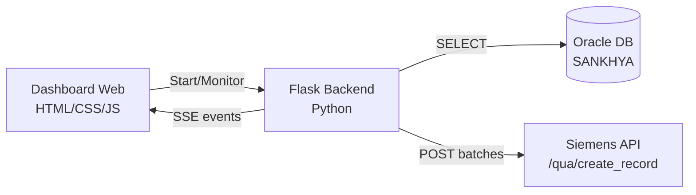

# Carga Retroativa Siemens POS — Plano de Implementação

Sistema de backfill para envio de dados retroativos do Oracle para a API Siemens Point of Sales, com dashboard web para monitoramento e controle em tempo real.

## Arquitetura



## Proposed Changes

### Backend — Flask + Python

#### [NEW] app.py
Servidor Flask principal com as seguintes rotas:
- `GET /` — Serve o dashboard web
- `POST /api/start` — Inicia o processo de carga retroativa em background thread
- `GET /api/status` — Retorna status atual (progresso, erros, registros processados)
- `GET /api/stream` — Server-Sent Events (SSE) para progresso em tempo real
- `POST /api/stop` — Para o processo em andamento

#### [NEW] db_oracle.py
Módulo de conexão com Oracle:
- Conexão via `oracledb` (driver thin, sem Oracle Client necessário)
- DSN: `CLOUD.MULTFER.COM.BR:21159/PROD`, User: `SANKHYA`, Pass: `laranja`
- Função `fetch_records()` executa a query SQL completa e retorna lista de dicts
- Tratamento de conexão com retry e timeout

#### [NEW] siemens_api.py
Módulo de integração com a API Siemens:
- Endpoint: `POST https://api.pos.siemens.com/qua/create_record`
- Função `send_batch(records)` — envia lote de até 3000 registros
- Retry com backoff exponencial (3 tentativas)
- Validação de resposta `201 Created`
- Log detalhado de cada requisição/resposta

#### [NEW] config.py
Configurações centralizadas via variáveis de ambiente (`.env`):
- Credenciais Oracle (host, port, service, user, pass)
- URL da API Siemens + credenciais/token de autenticação
- Tamanho do batch (padrão: 3000)
- Configurações de retry

#### [NEW] .env
Arquivo de variáveis de ambiente com as credenciais sensíveis (não commitado no Git).

---

### Frontend — Dashboard Web

#### [NEW] templates/index.html
Dashboard single-page com:
- **Header** com logo e título "Carga Retroativa Siemens"
- **Painel de Status** — cards com: Total de registros, Processados, Pendentes, Erros
- **Barra de Progresso** — animada, com porcentagem e ETA
- **Botões** — Start, Stop, Retry Falhas
- **Log em tempo real** — tabela scrollável com os últimos eventos
- **Tabela de Erros** — registros que falharam com opção de retry
- Conexão SSE para atualizações em tempo real

#### [NEW] static/style.css
Design premium com:
- Dark theme com glassmorphism
- Gradientes Siemens (teal/petrol `#009999` + dark `#1B1B1B`)
- Micro-animações e transições suaves
- Layout responsivo
- Google Font Inter

#### [NEW] static/app.js
Lógica do frontend:
- EventSource (SSE) para receber progresso em tempo real
- Atualização dinâmica da barra de progresso, contadores e log
- Controle de start/stop via fetch API
- Formatação de timestamps e status

---

### Infraestrutura

#### [NEW] requirements.txt
Dependências: `flask`, `oracledb`, `requests`, `python-dotenv`

#### [NEW] setup.bat
Script para criar `.venv`, instalar dependências e iniciar o servidor.

---

## Mapeamento SQL → JSON API

Os campos da query SQL serão mapeados para o payload JSON do POST:

| Campo SQL (alias) | Campo JSON API |
|---|---|
| `distributor_order_taking_branch_name` | `distributor_order_taking_branch_name` |
| `distributor_order_taking_branch_id` | `distributor_order_taking_branch_id` |
| `distributor_ship_from_branch_name` | `distributor_ship_from_branch_name` |
| `distributor_ship_from_branch_id` | `distributor_ship_from_branch_id` |
| `distributor_ship_from_address` | `distributor_ship_from_address` |
| `distributor_ship_from_city` | `distributor_ship_from_city` |
| `distributor_ship_from_state` | `distributor_ship_from_state` |
| `distributor_ship_from_zip` | `distributor_ship_from_zip` |
| `distributor_ship_from_country` | `distributor_ship_from_country` |
| `distributor_ship_date` | `distributor_ship_date` |
| `distributor_invoice_date` | `distributor_invoice_date` |
| `distributor_invoice_number` | `distributor_invoice_number` |
| `distributor_invoice_line_item` | `distributor_invoice_line_item` |
| `bill_to_customer_*` | `bill_to_customer_*` (todos os campos) |
| `ship_to_customer_*` | `ship_to_customer_*` (todos os campos) |
| `vendor_item_number` | `vendor_item_number` |
| `item_description` | `item_description` |
| `quantity` | `quantity` |
| `quantity_unit_of_measure` | `quantity_unit_of_measure` |
| `unit_cost` | `unit_cost` |
| `extended_cost_of_goods_sold` | `extended_cost_of_goods_sold` |
| `currency_code` | `currency_code` |

## Fluxo de Execução

1. Usuário clica **"Iniciar Carga"** no dashboard
2. Backend conecta no Oracle e executa o SELECT
3. Registros são divididos em batches de até 3000
4. Cada batch é enviado via POST para a API Siemens
5. Progresso é transmitido via SSE para o dashboard em tempo real
6. Ao final, relatório com total processado, erros e tempo decorrido

## Open Questions

> [!IMPORTANT]
> **Autenticação na API Siemens**: O cURL de exemplo não foi fornecido na mensagem. Preciso saber:
> 1. Qual o método de autenticação? (Bearer Token, API Key, Basic Auth?)
> 2. Você tem o token/chave de acesso da API?
> 
> Por ora, vou implementar com suporte a **Bearer Token** configurável via `.env`. Você poderá ajustar facilmente depois.

> [!NOTE]
> **Formato do payload**: Sem a documentação oficial da API, assumirei que o corpo do POST é um JSON com um array `records` contendo os objetos mapeados da query. Exemplo:
> ```json
> {
>   "records": [
>     { "distributor_order_taking_branch_name": "...", ... },
>     { "distributor_order_taking_branch_name": "...", ... }
>   ]
> }
> ```
> Se o formato for diferente, basta ajustar em `siemens_api.py`.

## Verification Plan

### Automated Tests
- Teste de conexão Oracle: `python -c "from db_oracle import get_connection; print(get_connection())"`
- Dry-run com `--dry-run` flag que busca dados mas não envia para API
- Validação do servidor Flask: `curl http://localhost:5000/api/status`

### Manual Verification
- Abrir dashboard no navegador em `http://localhost:5000`
- Verificar conexão com Oracle e contagem de registros
- Testar envio de batch único para validar formato
